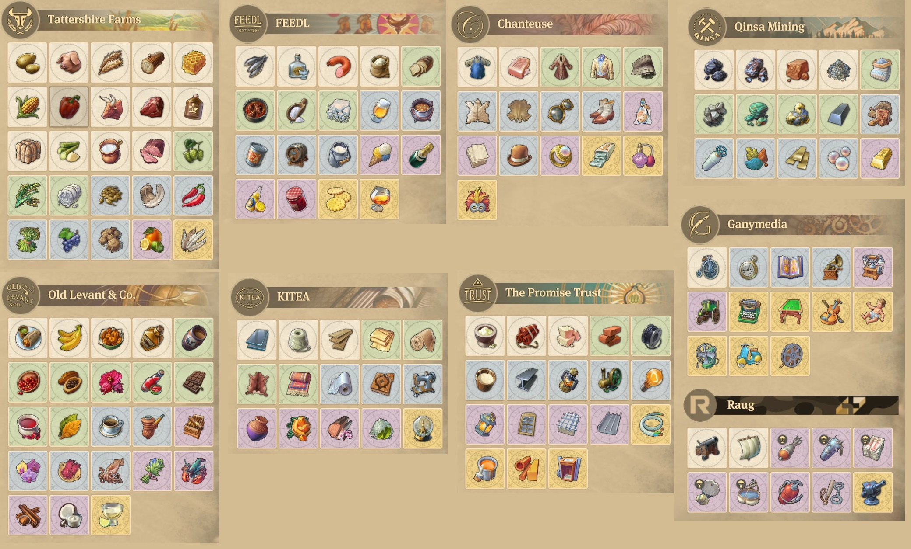

# Anno1800
My variations of existing Anno 1800 Mods

## Building materials at Traders
- Archibald now sells all the building materials
- Nate now Sells Scrap
- Isabel now also sells Building materials

## More Production Boosted By Items
Based on "Orchard Chemicals and Telephone Production Boosted By Items" by 997962520

- Chemical Plants are now in the "All production Buildings" Pool (where they should have been in the first place)
- Chemical Plants and Perfume Mixer are now boosted by Thielmanns Tube
- Orchards are now in the "All Production Buildings"  Pool (where they should have been in the first place)
- Telephone Factories now count as Carpenty works
- Arborist now also works for the Herb Farm
- Assembly Lines are now boosted by Conveyor Items (I mean, its only logical)

## More Trade Contracts
Based on the Spice it Up Version.
Adds mutliple new goods from DLC to docklands, including a new Weapon exporter called RAUG:

 
## NPC Dice Reworked
Based on "All items unlocked at traders" from iksaandry
- removed quest specific Slotables
- Added missing items from newer DLC
- moved attractiveness slotables
- moved Nates Inventions to Nate

##  Merge Industrial ConstructionCategory
Moves all Industrial Buildings from "DLC05 - Bright Harvest" to "CDLC 08 - Industrial Zone Menu", so all industrial ornaments are in the same category
